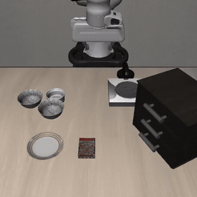
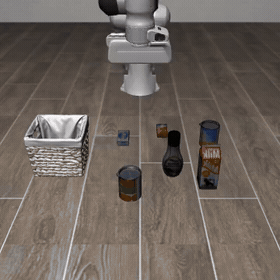
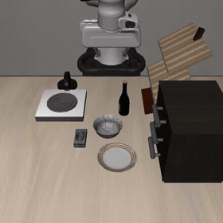
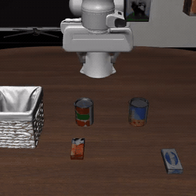
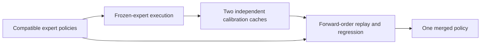

<div align="center">
  <h1>TCR</h1>
  <h3>Trajectory-Calibrated Regression for Robot Policy Merging</h3>
  <p><strong>Multiple specialists. One fixed robot policy.</strong></p>
  <p>
    <a href="#real-robot-demonstrations">Real-robot demos</a> ·
    <a href="#libero-demonstrations">LIBERO demos</a> ·
    <a href="docs/VIDEOS.md">All videos</a> ·
    <a href="https://chatonz.github.io/vla-merge/">Video gallery</a> ·
    <a href="#getting-started">Get started</a> ·
    <a href="docs/reproduction.md">Method &amp; code</a>
  </p>
</div>

TCR merges compatible robot specialists using inputs collected during frozen-expert execution. It replays the partially merged network in forward order and fits linear weights with prior-centered ridge regression, producing a **single policy with no additional inference-time router**. This release implements TCR for **π0.5 / LeRobot** and includes real-robot and LIBERO comparison videos.

## Real-robot demonstrations

Selected **TCR (ours)** recordings. Click a preview or its **Full video** link to open the MP4.

<table>
  <tr>
    <th align="center">Task 1 · TCR (ours)</th>
    <th align="center">Task 2 · TCR (ours)</th>
  </tr>
  <tr>
    <td><a href="assets/videos/real_robot/tcr/task1/img_5011.mp4"></a></td>
    <td><a href="assets/videos/real_robot/tcr/task2/img_5021.mp4"></a></td>
  </tr>
  <tr>
    <td align="center"><a href="assets/videos/real_robot/tcr/task1/img_5011.mp4">▶ Full video</a> · <a href="docs/VIDEOS.md#real-robot">All methods & recordings</a></td>
    <td align="center"><a href="assets/videos/real_robot/tcr/task2/img_5021.mp4">▶ Full video</a> · <a href="docs/VIDEOS.md#real-robot">All methods & recordings</a></td>
  </tr>
</table>

GIF previews play at **2× source speed**; MP4s retain the full visual duration. Task 1 and Task 2 follow the supplied folder labels. Each method has four recordings per task.

| Method | Task 1 | Task 2 |
| :--- | :---: | :---: |
| **TCR (ours)** | [4 videos](assets/videos/real_robot/tcr/task1/) | [4 videos](assets/videos/real_robot/tcr/task2/) |
| Expert | [4 videos](assets/videos/real_robot/experts/task1/) | [4 videos](assets/videos/real_robot/experts/task2/) |
| FeatCal | [4 videos](assets/videos/real_robot/featcal/task1/) | [4 videos](assets/videos/real_robot/featcal/task2/) |
| RegMean++ | [4 videos](assets/videos/real_robot/regmeanpp/task1/) | [4 videos](assets/videos/real_robot/regmeanpp/task2/) |
| Mean Soup | [4 videos](assets/videos/real_robot/soup/task1/) | [4 videos](assets/videos/real_robot/soup/task2/) |
| TIES | [4 videos](assets/videos/real_robot/ties/task1/) | [4 videos](assets/videos/real_robot/ties/task2/) |

## LIBERO demonstrations

Selected **TCR (ours)** episodes across four suites. These examples carry `success` labels in the supplied filenames; the complete collection also includes failure episodes.

<table>
  <tr><th align="center">LIBERO-Spatial</th><th align="center">LIBERO-Object</th><th align="center">LIBERO-Goal</th><th align="center">LIBERO-Long</th></tr>
  <tr>
    <td><a href="assets/videos/libero/tcr/libero_spatial/task00_r01_ep00_success.mp4"></a></td>
    <td><a href="assets/videos/libero/tcr/libero_object/task00_r01_ep00_success.mp4"></a></td>
    <td><a href="assets/videos/libero/tcr/libero_goal/task00_r01_ep01_success.mp4"></a></td>
    <td><a href="assets/videos/libero/tcr/libero_10/task00_r01_ep00_success.mp4"></a></td>
  </tr>
  <tr>
    <td align="center"><a href="assets/videos/libero/tcr/libero_spatial/task00_r01_ep00_success.mp4">▶ Full video</a></td>
    <td align="center"><a href="assets/videos/libero/tcr/libero_object/task00_r01_ep00_success.mp4">▶ Full video</a></td>
    <td align="center"><a href="assets/videos/libero/tcr/libero_goal/task00_r01_ep01_success.mp4">▶ Full video</a></td>
    <td align="center"><a href="assets/videos/libero/tcr/libero_10/task00_r01_ep00_success.mp4">▶ Full video</a></td>
  </tr>
</table>

GIF previews play at **0.25× the supplied MP4 playback speed** for readability. Original MP4 timing is unchanged. LIBERO-Long corresponds to the `libero_10` directory.

The [complete LIBERO index](docs/VIDEOS.md#libero) includes **TCR, Experts, FeatCal, RegMean, RegMean++, Mean Soup, TIES, Task Arithmetic, KNOTS-TIES, and WUDI**: three episodes per suite for every method. Videos illustrate behavior and are not aggregate benchmark measurements.

## Browse all 168 videos

- **[Video index](docs/VIDEOS.md)** — every recording, grouped by domain, task, and method; works directly on GitHub.
- **[Interactive gallery](https://chatonz.github.io/vla-merge/)** — filter methods and tasks, then play full videos in the browser. See [Publishing](docs/PUBLISHING.md) for local preview and deployment instructions.
- **[Media manifest](assets/media.json)** — paths, durations, dimensions, source filenames, and supplied outcome labels.

To view the gallery locally, run this from the repository root and open **http://localhost:8000**:

```bash
python -m http.server 8000
```

## How TCR works



1. **Collect execution inputs.** Record native generation states from complete frozen-expert episodes.
2. **Fit in forward order.** Replay the partially merged network and solve prior-centered ridge regressions for linear modules.
3. **Calibrate twice.** Start pass 1 from the expert mean; pass 2 uses the first pass as its prior and inherits its numerical ridge map.
4. **Deploy one policy.** The resulting π0.5 checkpoint needs no extra inference router.

The supported scope covers **418 linear modules and 422 adapted tensors**. The source also provides Model Soups, TIES, RegMean++, and FeatCal baselines, component ablations, and small parameter-study generators. Some additional methods appear only in the supplied comparison videos; their implementations are not included here.

## Getting started

Use **Python 3.12** and the pinned π0.5 environment. See [Environment setup](docs/SETUP.md) for the full dependency and simulator instructions.

```bash
# Clone the repository, then use your Python 3.12 environment:
git clone https://github.com/Chatonz/vla-merge.git
cd vla-merge
python -m pip install -c requirements/constraints.txt -e '.[pi05,test]'
pytest -q

# Optional: LIBERO rollout collection and evaluation
python -m pip install -c requirements/constraints.txt -e '.[libero]'
```

Prepare a shared dense base, compatible expert checkpoints, and two execution caches per expert, then edit [configs/pi05.json](configs/pi05.json). Paths resolve relative to the configuration file.

```bash
tcr check --config configs/pi05.json
tcr merge --config configs/pi05.json --dry-run
tcr merge --config configs/pi05.json
```

The final merged policy is written to `outputs/main/merged/`. The [step-by-step usage guide](docs/USAGE.md) covers expert export, cache collection, merging, ablations, and evaluation.

Model weights, calibration caches, datasets, simulator assets, and historical evaluation records are not bundled. Full merging requires a compatible model runtime and substantial host/GPU memory. See [reproduction scope](docs/reproduction.md) for the inputs needed to reproduce the paper's exact results.

## Repository layout

```text
src/                 TCR implementation, baselines, calibration, and π0.5 adapters
configs/             Merge and calibration examples
scripts/             CLI wrappers and media preparation tools
examples/            Integration with an existing rollout loop
tests/               Numerical and workflow checks
docs/                Setup, usage, video index, and validation notes
assets/videos/       48 real-robot MP4s + 120 LIBERO MP4s
assets/previews/     Six animated README previews
assets/posters/      Video thumbnails
assets/media.json    Complete media manifest
index.html           Browser video gallery
```

## Documentation

| Guide | Contents |
| :--- | :--- |
| [Setup](docs/SETUP.md) · [Usage](docs/USAGE.md) | Environment and end-to-end workflow |
| [Method & reproduction](docs/reproduction.md) | Method-to-code mapping and reproduction requirements |
| [Real-robot baselines](docs/REAL_ROBOT_BASELINES.md) | Baseline configurations and commands |
| [Experiments](docs/experiments.md) | Component ablations and parameter studies |
| [Validation](docs/VALIDATION.md) | Historical implementation checks and their scope |
| [Video index](docs/VIDEOS.md) · [Publishing](docs/PUBLISHING.md) | Media collection and GitHub setup |

## License

The implementation is distributed under Apache-2.0; see [LICENSE](LICENSE). LeRobot, Transformers, PEFT, model weights, and datasets retain their own licenses. Video provenance and export details are listed in the [media index](docs/VIDEOS.md).
