<div align="center">
  <h1>TCR</h1>
  <h3>Trajectory-Calibrated Regression for Robot Policy Merging</h3>
  <p><strong>Multiple specialists. One fixed robot policy.</strong></p>
  <p>
    <a href="#1-tcr-on-a-real-robot">TCR on a real robot</a> ·
    <a href="#2-real-robot-method-comparisons">Real-robot comparisons</a> ·
    <a href="#3-libero-method-comparisons">LIBERO comparisons</a> ·
    <a href="#4-more-trials-and-failure-cases">More trials &amp; failures</a> ·
    <a href="#5-complete-video-collection">All recordings</a>
  </p>
</div>

TCR merges compatible robot specialists into **one fixed policy without an additional inference-time router**. This page presents the visual supplement for the π0.5 / LeRobot implementation: real-robot demonstrations first, followed by comparisons on real tasks and four LIBERO suites.

**Start with Sections 1–2 for the real-robot results, then Section 3 for simulation comparisons.** All main comparisons animate directly below; click a panel for a larger MP4. Playback speeds and clip-selection rules are stated beside the figures. These recordings illustrate individual behavior; aggregate performance belongs in the paper's quantitative evaluation.

## 1. TCR on a real robot

Two TCR recordings introduce the real tasks. The original collection names are **Task 1** and **Task 2**.

<table>
  <tr><th align="center">Task 1 · TCR (ours)</th><th align="center">Task 2 · TCR (ours)</th></tr>
  <tr>
    <td><a href="assets/videos/real_robot/tcr/task1/img_5011.mp4">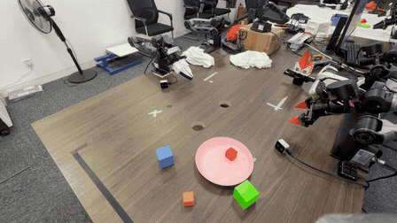</a></td>
    <td><a href="assets/videos/real_robot/tcr/task2/img_5021.mp4">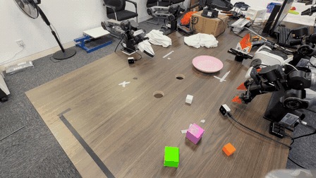</a></td>
  </tr>
  <tr>
    <td align="center"><a href="assets/videos/real_robot/tcr/task1/img_5011.mp4">▶ Original-speed video</a> · IMG_5011</td>
    <td align="center"><a href="assets/videos/real_robot/tcr/task2/img_5021.mp4">▶ Original-speed video</a> · IMG_5021</td>
  </tr>
</table>

**Preview speed: 2×.** The linked recordings preserve their full visual duration. All eight supplied TCR real-robot recordings are previewed in [Section 4](#4-more-trials-and-failure-cases).

## 2. Real-robot method comparisons

Each panel follows **Soup → TIES → RegMean++ → FeatCal → TCR → Expert**, read left to right across the top row, then the bottom row. The first five entries are merging methods. **Expert is a reference policy**, placed last in a separately marked frame; TCR is labeled **ours**. Both tasks use the first recording in filename order for every method. Trials were recorded independently, with different initial scenes; these are task-level visual comparisons, not paired-reset measurements.

**All tiles play at 2× source speed.** A finished clip holds its last frame and is marked as ended while longer recordings continue. No recording is shortened to match another.

### Task 1

[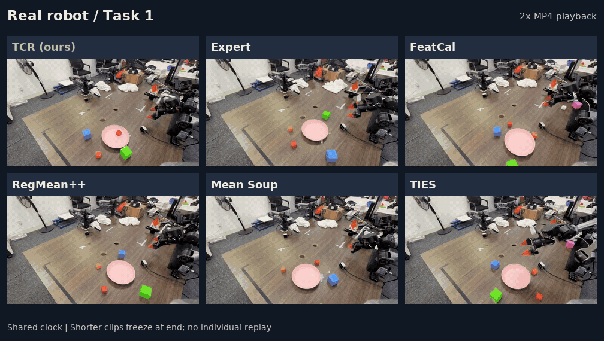](assets/comparisons/real-task1.mp4)

[▶ Larger comparison MP4 · 2×](assets/comparisons/real-task1.mp4) · [All Task 1 recordings](docs/VIDEOS.md#task-1)

### Task 2

[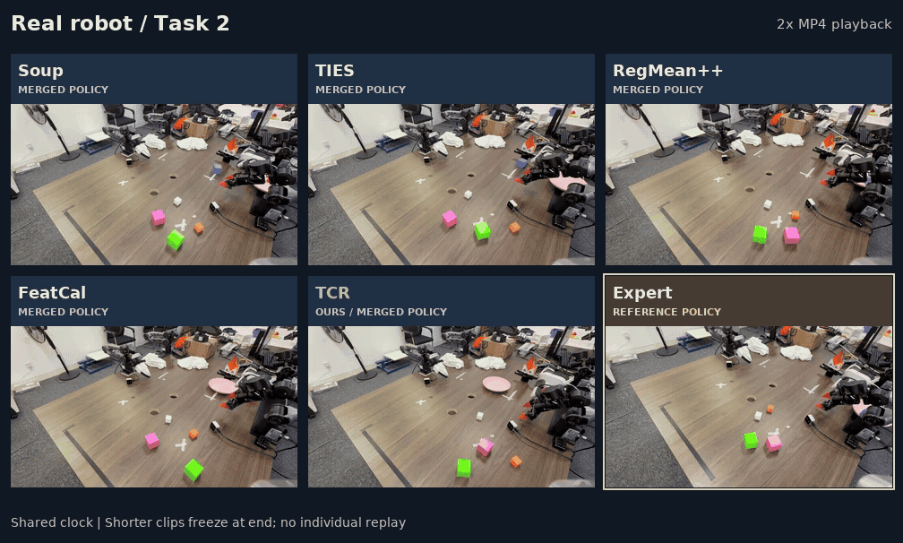](assets/comparisons/real-task2.mp4)

[▶ Larger comparison MP4 · 2×](assets/comparisons/real-task2.mp4) · [All Task 2 recordings](docs/VIDEOS.md#task-2)

## 3. LIBERO method comparisons

The same order of five merging methods followed by the Expert reference is used across **Long, Object, Goal, and Spatial**. Long-horizon behavior is shown first, followed by object, goal, and spatial variation. The complete collection includes four additional methods in the [full index](docs/VIDEOS.md#libero).

**All tiles play at 0.25× the supplied MP4 playback speed.** Every panel uses the same task/run/episode identifiers across its methods: `task00 / r01 / ep00` for Long, Object, and Spatial; `task00 / r01 / ep01` for Goal. The Goal panel uses episode 01 as a successful TCR example; the failure from episode 00 appears in [Section 4](#4-more-trials-and-failure-cases). Success/failure labels are copied from the supplied filenames. Ended clips hold their final frame; the labels describe these individual episodes.

### LIBERO-Long

[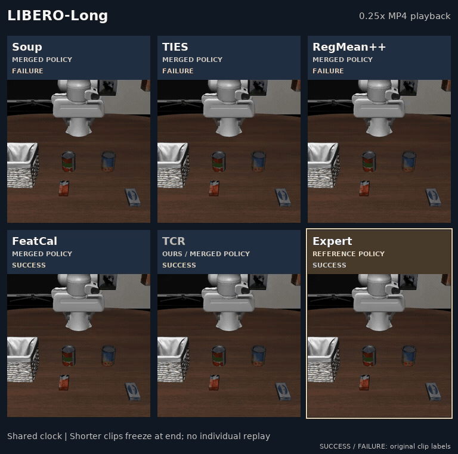](assets/comparisons/libero-long.mp4)

[▶ Larger comparison MP4 · 0.25×](assets/comparisons/libero-long.mp4) · [All LIBERO-Long recordings](docs/VIDEOS.md#libero-long)

### LIBERO-Object

[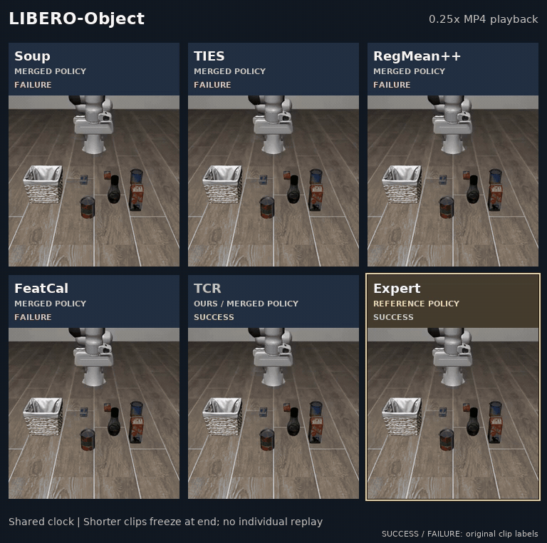](assets/comparisons/libero-object.mp4)

[▶ Larger comparison MP4 · 0.25×](assets/comparisons/libero-object.mp4) · [All LIBERO-Object recordings](docs/VIDEOS.md#libero-object)

### LIBERO-Goal

[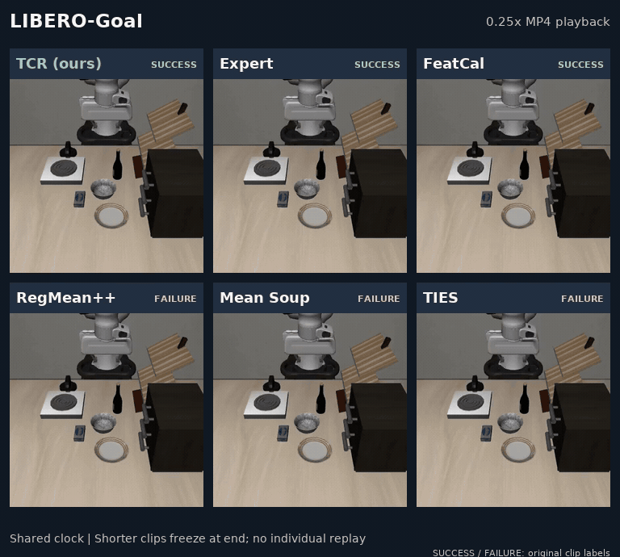](assets/comparisons/libero-goal.mp4)

[▶ Larger comparison MP4 · 0.25×](assets/comparisons/libero-goal.mp4) · [All LIBERO-Goal recordings](docs/VIDEOS.md#libero-goal)

### LIBERO-Spatial

[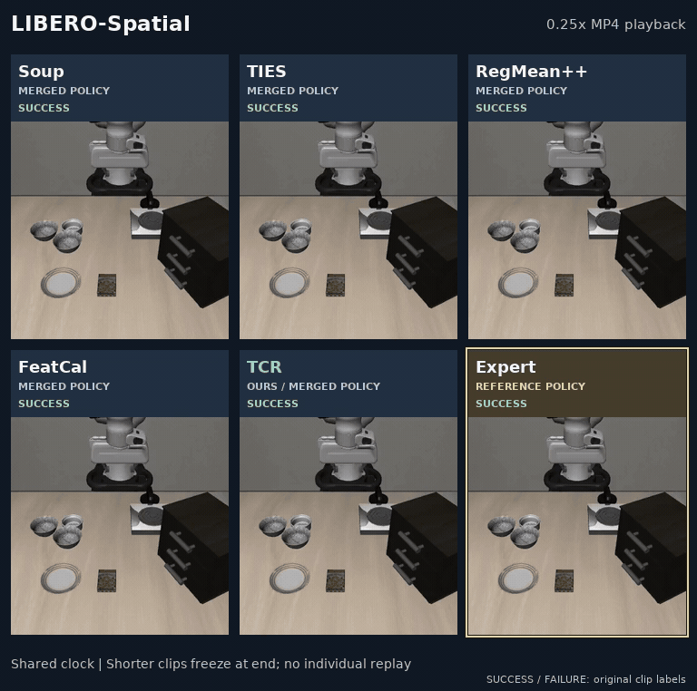](assets/comparisons/libero-spatial.mp4)

[▶ Larger comparison MP4 · 0.25×](assets/comparisons/libero-spatial.mp4) · [All LIBERO-Spatial recordings](docs/VIDEOS.md#libero-spatial)

## 4. More trials and failure cases

### Additional TCR real-robot trials

Expand either task to inspect **every supplied TCR recording**, including the two previews in Section 1. All previews below run at 2× source speed; each links to its full original-speed MP4.

<details>
<summary><strong>Task 1 — all four TCR recordings</strong></summary>

<table>
  <tr>
    <th align="center">Recording 1 · IMG_5011</th>
    <th align="center">Recording 2 · IMG_5012</th>
    <th align="center">Recording 3 · IMG_5013</th>
    <th align="center">Recording 4 · IMG_5014</th>
  </tr>
  <tr>
    <td><a href="assets/videos/real_robot/tcr/task1/img_5011.mp4"></a></td>
    <td><a href="assets/videos/real_robot/tcr/task1/img_5012.mp4">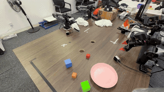</a></td>
    <td><a href="assets/videos/real_robot/tcr/task1/img_5013.mp4">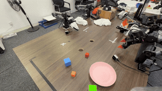</a></td>
    <td><a href="assets/videos/real_robot/tcr/task1/img_5014.mp4">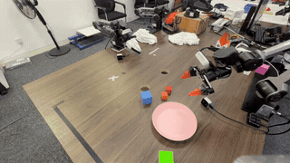</a></td>
  </tr>
  <tr>
    <td align="center"><a href="assets/videos/real_robot/tcr/task1/img_5011.mp4">▶ Original-speed MP4</a></td>
    <td align="center"><a href="assets/videos/real_robot/tcr/task1/img_5012.mp4">▶ Original-speed MP4</a></td>
    <td align="center"><a href="assets/videos/real_robot/tcr/task1/img_5013.mp4">▶ Original-speed MP4</a></td>
    <td align="center"><a href="assets/videos/real_robot/tcr/task1/img_5014.mp4">▶ Original-speed MP4</a></td>
  </tr>
</table>

</details>

<details>
<summary><strong>Task 2 — all four TCR recordings</strong></summary>

<table>
  <tr>
    <th align="center">Recording 1 · IMG_5021</th>
    <th align="center">Recording 2 · IMG_5022</th>
    <th align="center">Recording 3 · IMG_5026</th>
    <th align="center">Recording 4 · IMG_5028</th>
  </tr>
  <tr>
    <td><a href="assets/videos/real_robot/tcr/task2/img_5021.mp4"></a></td>
    <td><a href="assets/videos/real_robot/tcr/task2/img_5022.mp4">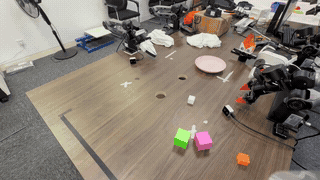</a></td>
    <td><a href="assets/videos/real_robot/tcr/task2/img_5026.mp4">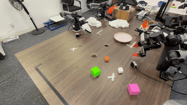</a></td>
    <td><a href="assets/videos/real_robot/tcr/task2/img_5028.mp4">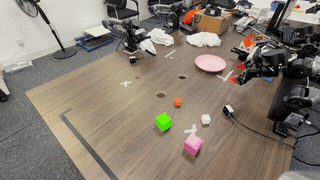</a></td>
  </tr>
  <tr>
    <td align="center"><a href="assets/videos/real_robot/tcr/task2/img_5021.mp4">▶ Original-speed MP4</a></td>
    <td align="center"><a href="assets/videos/real_robot/tcr/task2/img_5022.mp4">▶ Original-speed MP4</a></td>
    <td align="center"><a href="assets/videos/real_robot/tcr/task2/img_5026.mp4">▶ Original-speed MP4</a></td>
    <td align="center"><a href="assets/videos/real_robot/tcr/task2/img_5028.mp4">▶ Original-speed MP4</a></td>
  </tr>
</table>

</details>

### TCR failure examples in LIBERO

The supplied collection also contains TCR episodes labeled **failure**. Two are shown here alongside the earlier successful examples, so the supplement includes observable limitations as well as selected demonstrations. The preview speed is 0.25× the supplied file playback speed.

<table>
  <tr><th align="center">LIBERO-Object · episode 01 · failure</th><th align="center">LIBERO-Goal · episode 00 · failure</th></tr>
  <tr>
    <td align="center"><a href="assets/videos/libero/tcr/libero_object/task00_r01_ep01_failure.mp4">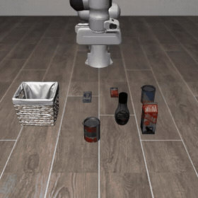</a></td>
    <td align="center"><a href="assets/videos/libero/tcr/libero_goal/task00_r01_ep00_failure.mp4">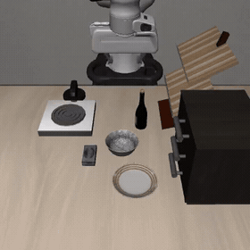</a></td>
  </tr>
  <tr>
    <td align="center"><a href="assets/videos/libero/tcr/libero_object/task00_r01_ep01_failure.mp4">▶ Supplied-speed MP4</a></td>
    <td align="center"><a href="assets/videos/libero/tcr/libero_goal/task00_r01_ep00_failure.mp4">▶ Supplied-speed MP4</a></td>
  </tr>
</table>

## 5. Complete video collection

| Collection | Coverage | Open |
| :--- | :--- | :--- |
| Real robot | 5 merging methods + Expert · 2 tasks · 4 recordings each = **48 clips** | [Every real-robot recording](docs/VIDEOS.md#real-robot) |
| LIBERO | 9 merging methods + Expert · 4 suites · 3 episodes each = **120 clips** | [Every LIBERO recording](docs/VIDEOS.md#libero) |
| Figure provenance | Exact inputs, playback factors, and final-frame padding for all six comparison panels | [Comparison manifest](assets/comparisons/manifest.json) |

The main comparisons follow **Soup, TIES, RegMean++, FeatCal, TCR, and Expert (reference)**. The full LIBERO collection also includes **RegMean, Task Arithmetic, KnOTS-TIES, and WUDI**. Success and failure recordings are both retained. Real-robot outcomes were not annotated in the supplied files. GIFs and comparison MP4s are viewing derivatives; all **168 supplied recordings** remain available through the index above.

All images and video links on this page use relative paths. An optional [browser gallery](index.html) provides filters and native video controls when served as a website. To view it locally, run `python -m http.server 8000` from the repository root and open `http://localhost:8000`.

## 6. Method and source code

TCR collects inputs during frozen-expert execution, replays the partially merged network in forward order, and fits linear modules with prior-centered ridge regression. Two calibration passes produce one fixed π0.5 policy without an additional inference-time router. The supported scope contains **418 linear modules and 422 adapted tensors**.

| Resource | Contents |
| :--- | :--- |
| [Method-to-code mapping](docs/reproduction.md) | Merge equations, native replay, implementation scope, and reproduction requirements |
| [Setup](docs/SETUP.md) · [Usage](docs/USAGE.md) | Dependencies, expert preparation, calibration, merging, and evaluation |
| [Real-robot baselines](docs/REAL_ROBOT_BASELINES.md) | Model Soups, TIES, RegMean++, and FeatCal implementations |
| [Experiments](docs/experiments.md) | Component ablations and parameter-study generators |
| [Validation](docs/VALIDATION.md) | Historical implementation checks and their scope |

<details>
<summary><strong>Installation and a minimal merge command</strong></summary>

Use Python 3.12 and the pinned π0.5 runtime described in the setup guide. From the downloaded repository root:

```bash
python -m pip install -c requirements/constraints.txt -e '.[pi05,test]'
pytest -q

# After preparing expert checkpoints and calibration caches:
tcr check --config configs/pi05.json
tcr merge --config configs/pi05.json --dry-run
tcr merge --config configs/pi05.json
```

Edit [configs/pi05.json](configs/pi05.json); paths resolve relative to the configuration file. The final model is written to `outputs/main/merged/`. Model weights, calibration caches, datasets, simulator assets, and historical evaluation records are not bundled. Full merging requires a compatible runtime and substantial host/GPU memory.

</details>

The implementation is distributed under Apache-2.0; see [LICENSE](LICENSE). Third-party models, libraries, and datasets retain their own licenses.
