# Video collection

[← Back to TCR](../README.md)

All **168 supplied recordings**: 48 real-robot clips and 120 LIBERO episodes. Click a thumbnail or a recording link to open its MP4.

The main comparison order is **Soup → TIES → RegMean++ → FeatCal → TCR → Expert**. Expert is a reference policy and is listed last. Additional LIBERO baselines appear before TCR and the Expert reference in the complete tables.

[Real robot](#real-robot) · [LIBERO](#libero) · [Provenance](#provenance)

## Real robot

Five merging methods plus the Expert reference, two tasks, and four recordings per entry/task. Task names follow the supplied folder labels. No success/failure annotations were provided for these recordings.

### Task 1

| Method / reference | Preview | Recordings |
| :--- | :---: | :--- |
| Soup | <a href="../assets/videos/real_robot/soup/task1/img_5029.mp4">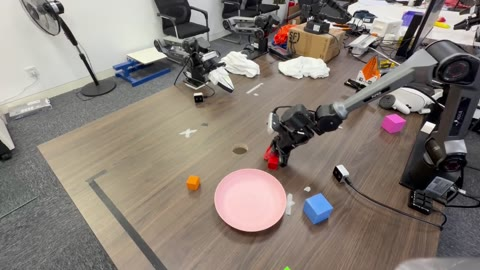</a> | [IMG_5029](../assets/videos/real_robot/soup/task1/img_5029.mp4) (17.2s) · [IMG_5031](../assets/videos/real_robot/soup/task1/img_5031.mp4) (15.8s) · [IMG_5032](../assets/videos/real_robot/soup/task1/img_5032.mp4) (18.5s) · [IMG_5034](../assets/videos/real_robot/soup/task1/img_5034.mp4) (10.7s) |
| TIES | <a href="../assets/videos/real_robot/ties/task1/img_5041.mp4">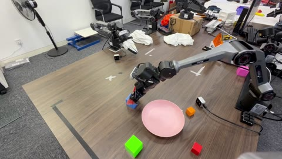</a> | [IMG_5041](../assets/videos/real_robot/ties/task1/img_5041.mp4) (8.8s) · [IMG_5042](../assets/videos/real_robot/ties/task1/img_5042.mp4) (10.1s) · [IMG_5043](../assets/videos/real_robot/ties/task1/img_5043.mp4) (12.0s) · [IMG_5044](../assets/videos/real_robot/ties/task1/img_5044.mp4) (14.5s) |
| RegMean++ | <a href="../assets/videos/real_robot/regmeanpp/task1/img_5053.mp4">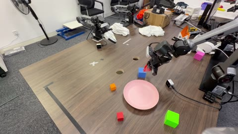</a> | [IMG_5053](../assets/videos/real_robot/regmeanpp/task1/img_5053.mp4) (17.4s) · [IMG_5054](../assets/videos/real_robot/regmeanpp/task1/img_5054.mp4) (10.5s) · [IMG_5055](../assets/videos/real_robot/regmeanpp/task1/img_5055.mp4) (8.6s) · [IMG_5056](../assets/videos/real_robot/regmeanpp/task1/img_5056.mp4) (15.5s) |
| FeatCal | <a href="../assets/videos/real_robot/featcal/task1/img_5061.mp4">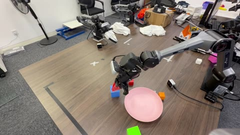</a> | [IMG_5061](../assets/videos/real_robot/featcal/task1/img_5061.mp4) (20.3s) · [IMG_5062](../assets/videos/real_robot/featcal/task1/img_5062.mp4) (7.7s) · [IMG_5064](../assets/videos/real_robot/featcal/task1/img_5064.mp4) (15.8s) · [IMG_5066](../assets/videos/real_robot/featcal/task1/img_5066.mp4) (32.6s) |
| **TCR (ours)** | <a href="../assets/videos/real_robot/tcr/task1/img_5011.mp4">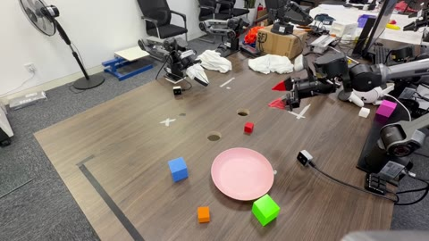</a> | [IMG_5011](../assets/videos/real_robot/tcr/task1/img_5011.mp4) (12.9s) · [IMG_5012](../assets/videos/real_robot/tcr/task1/img_5012.mp4) (10.5s) · [IMG_5013](../assets/videos/real_robot/tcr/task1/img_5013.mp4) (14.3s) · [IMG_5014](../assets/videos/real_robot/tcr/task1/img_5014.mp4) (15.3s) |
| **Expert (reference)** | <a href="../assets/videos/real_robot/experts/task1/img_4995.mp4">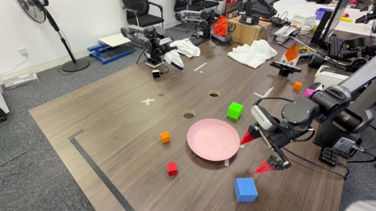</a> | [IMG_4995](../assets/videos/real_robot/experts/task1/img_4995.mp4) (9.6s) · [IMG_4997](../assets/videos/real_robot/experts/task1/img_4997.mp4) (10.9s) · [IMG_5001](../assets/videos/real_robot/experts/task1/img_5001.mp4) (12.1s) · [IMG_5004](../assets/videos/real_robot/experts/task1/img_5004.mp4) (8.1s) |

### Task 2

| Method / reference | Preview | Recordings |
| :--- | :---: | :--- |
| Soup | <a href="../assets/videos/real_robot/soup/task2/img_5035.mp4">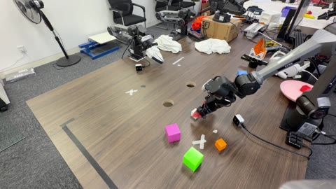</a> | [IMG_5035](../assets/videos/real_robot/soup/task2/img_5035.mp4) (24.9s) · [IMG_5036](../assets/videos/real_robot/soup/task2/img_5036.mp4) (32.7s) · [IMG_5039](../assets/videos/real_robot/soup/task2/img_5039.mp4) (37.4s) · [IMG_5040](../assets/videos/real_robot/soup/task2/img_5040.mp4) (43.6s) |
| TIES | <a href="../assets/videos/real_robot/ties/task2/img_5046.mp4">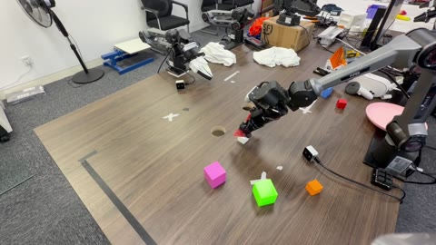</a> | [IMG_5046](../assets/videos/real_robot/ties/task2/img_5046.mp4) (20.4s) · [IMG_5047](../assets/videos/real_robot/ties/task2/img_5047.mp4) (37.0s) · [IMG_5048](../assets/videos/real_robot/ties/task2/img_5048.mp4) (20.9s) · [IMG_5052](../assets/videos/real_robot/ties/task2/img_5052.mp4) (40.4s) |
| RegMean++ | <a href="../assets/videos/real_robot/regmeanpp/task2/img_5057.mp4">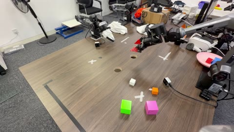</a> | [IMG_5057](../assets/videos/real_robot/regmeanpp/task2/img_5057.mp4) (24.9s) · [IMG_5058](../assets/videos/real_robot/regmeanpp/task2/img_5058.mp4) (25.5s) · [IMG_5059](../assets/videos/real_robot/regmeanpp/task2/img_5059.mp4) (73.0s) · [IMG_5060](../assets/videos/real_robot/regmeanpp/task2/img_5060.mp4) (60.4s) |
| FeatCal | <a href="../assets/videos/real_robot/featcal/task2/img_5067.mp4">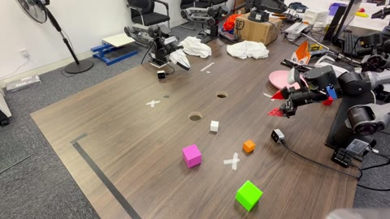</a> | [IMG_5067](../assets/videos/real_robot/featcal/task2/img_5067.mp4) (10.9s) · [IMG_5069](../assets/videos/real_robot/featcal/task2/img_5069.mp4) (60.4s) · [IMG_5070](../assets/videos/real_robot/featcal/task2/img_5070.mp4) (49.5s) · [IMG_5072](../assets/videos/real_robot/featcal/task2/img_5072.mp4) (29.2s) |
| **TCR (ours)** | <a href="../assets/videos/real_robot/tcr/task2/img_5021.mp4">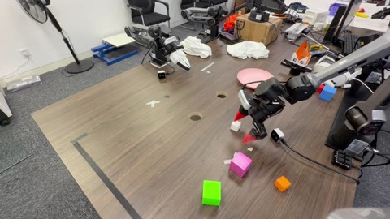</a> | [IMG_5021](../assets/videos/real_robot/tcr/task2/img_5021.mp4) (24.7s) · [IMG_5022](../assets/videos/real_robot/tcr/task2/img_5022.mp4) (13.4s) · [IMG_5026](../assets/videos/real_robot/tcr/task2/img_5026.mp4) (24.5s) · [IMG_5028](../assets/videos/real_robot/tcr/task2/img_5028.mp4) (11.1s) |
| **Expert (reference)** | <a href="../assets/videos/real_robot/experts/task2/img_5007.mp4">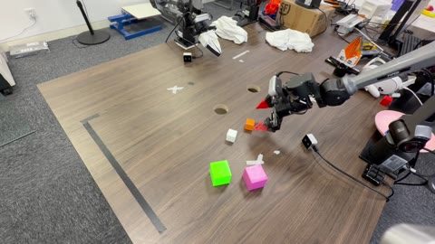</a> | [IMG_5007](../assets/videos/real_robot/experts/task2/img_5007.mp4) (10.4s) · [IMG_5008](../assets/videos/real_robot/experts/task2/img_5008.mp4) (13.9s) · [IMG_5009](../assets/videos/real_robot/experts/task2/img_5009.mp4) (12.8s) · [IMG_5010](../assets/videos/real_robot/experts/task2/img_5010.mp4) (12.1s) |

## LIBERO

Nine merging methods plus the Expert reference, four suites, and three episodes per entry/suite. All supplied episodes are task `00`, run `01`. Outcome labels come from source filenames and are not independently re-evaluated. These clips are qualitative examples, not aggregate benchmark results.

LIBERO-Long uses the `libero_10` directory. The gallery and MP4s retain the supplied playback timing.

### LIBERO-Spatial

| Method / reference | Preview | Recordings |
| :--- | :---: | :--- |
| Soup | <a href="../assets/videos/libero/soup/libero_spatial/task00_r01_ep00_success.mp4">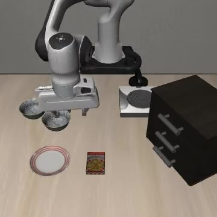</a> | [ep00 · success](../assets/videos/libero/soup/libero_spatial/task00_r01_ep00_success.mp4) (1.2s) · [ep01 · success](../assets/videos/libero/soup/libero_spatial/task00_r01_ep01_success.mp4) (1.2s) · [ep02 · success](../assets/videos/libero/soup/libero_spatial/task00_r01_ep02_success.mp4) (1.1s) |
| TIES | <a href="../assets/videos/libero/ties/libero_spatial/task00_r01_ep00_success.mp4">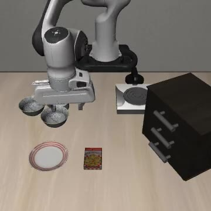</a> | [ep00 · success](../assets/videos/libero/ties/libero_spatial/task00_r01_ep00_success.mp4) (1.1s) · [ep01 · success](../assets/videos/libero/ties/libero_spatial/task00_r01_ep01_success.mp4) (1.1s) · [ep02 · success](../assets/videos/libero/ties/libero_spatial/task00_r01_ep02_success.mp4) (2.7s) |
| RegMean++ | <a href="../assets/videos/libero/regmeanpp/libero_spatial/task00_r01_ep00_success.mp4"></a> | [ep00 · success](../assets/videos/libero/regmeanpp/libero_spatial/task00_r01_ep00_success.mp4) (1.1s) · [ep01 · success](../assets/videos/libero/regmeanpp/libero_spatial/task00_r01_ep01_success.mp4) (1.1s) · [ep02 · success](../assets/videos/libero/regmeanpp/libero_spatial/task00_r01_ep02_success.mp4) (1.1s) |
| FeatCal | <a href="../assets/videos/libero/featcal/libero_spatial/task00_r01_ep00_success.mp4"></a> | [ep00 · success](../assets/videos/libero/featcal/libero_spatial/task00_r01_ep00_success.mp4) (1.1s) · [ep01 · success](../assets/videos/libero/featcal/libero_spatial/task00_r01_ep01_success.mp4) (1.1s) · [ep02 · success](../assets/videos/libero/featcal/libero_spatial/task00_r01_ep02_success.mp4) (1.2s) |
| RegMean | <a href="../assets/videos/libero/regmean/libero_spatial/task00_r01_ep00_success.mp4"></a> | [ep00 · success](../assets/videos/libero/regmean/libero_spatial/task00_r01_ep00_success.mp4) (1.1s) · [ep01 · success](../assets/videos/libero/regmean/libero_spatial/task00_r01_ep01_success.mp4) (1.1s) · [ep02 · success](../assets/videos/libero/regmean/libero_spatial/task00_r01_ep02_success.mp4) (1.1s) |
| KnOTS-TIES | <a href="../assets/videos/libero/knots_ties/libero_spatial/task00_r01_ep00_success.mp4">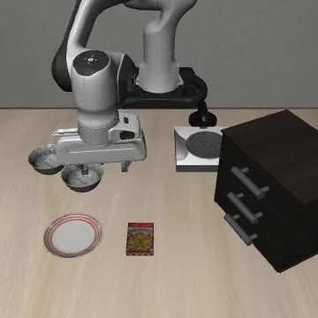</a> | [ep00 · success](../assets/videos/libero/knots_ties/libero_spatial/task00_r01_ep00_success.mp4) (1.2s) · [ep01 · success](../assets/videos/libero/knots_ties/libero_spatial/task00_r01_ep01_success.mp4) (1.2s) · [ep02 · success](../assets/videos/libero/knots_ties/libero_spatial/task00_r01_ep02_success.mp4) (1.6s) |
| Task Arithmetic | <a href="../assets/videos/libero/task_arithmetic/libero_spatial/task00_r01_ep00_success.mp4">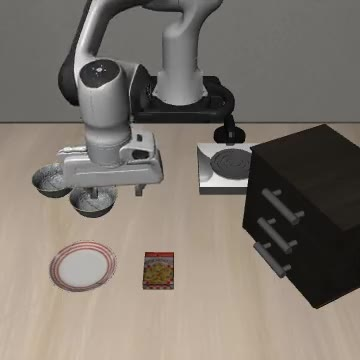</a> | [ep00 · success](../assets/videos/libero/task_arithmetic/libero_spatial/task00_r01_ep00_success.mp4) (1.2s) · [ep01 · success](../assets/videos/libero/task_arithmetic/libero_spatial/task00_r01_ep01_success.mp4) (1.1s) · [ep02 · success](../assets/videos/libero/task_arithmetic/libero_spatial/task00_r01_ep02_success.mp4) (1.1s) |
| WUDI | <a href="../assets/videos/libero/wudi/libero_spatial/task00_r01_ep00_success.mp4">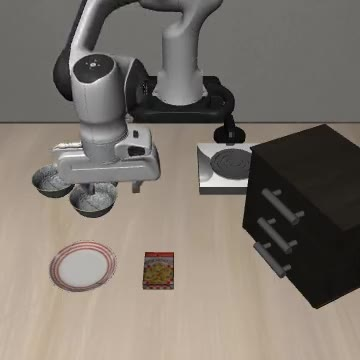</a> | [ep00 · success](../assets/videos/libero/wudi/libero_spatial/task00_r01_ep00_success.mp4) (1.1s) · [ep01 · success](../assets/videos/libero/wudi/libero_spatial/task00_r01_ep01_success.mp4) (1.1s) · [ep02 · success](../assets/videos/libero/wudi/libero_spatial/task00_r01_ep02_success.mp4) (1.1s) |
| **TCR (ours)** | <a href="../assets/videos/libero/tcr/libero_spatial/task00_r01_ep00_success.mp4"></a> | [ep00 · success](../assets/videos/libero/tcr/libero_spatial/task00_r01_ep00_success.mp4) (1.1s) · [ep01 · success](../assets/videos/libero/tcr/libero_spatial/task00_r01_ep01_success.mp4) (1.0s) · [ep02 · success](../assets/videos/libero/tcr/libero_spatial/task00_r01_ep02_success.mp4) (1.0s) |
| **Expert (reference)** | <a href="../assets/videos/libero/experts/libero_spatial/task00_r01_ep00_success.mp4"></a> | [ep00 · success](../assets/videos/libero/experts/libero_spatial/task00_r01_ep00_success.mp4) (1.0s) · [ep01 · success](../assets/videos/libero/experts/libero_spatial/task00_r01_ep01_success.mp4) (0.9s) · [ep02 · success](../assets/videos/libero/experts/libero_spatial/task00_r01_ep02_success.mp4) (1.0s) |

### LIBERO-Object

| Method / reference | Preview | Recordings |
| :--- | :---: | :--- |
| Soup | <a href="../assets/videos/libero/soup/libero_object/task00_r01_ep00_failure.mp4">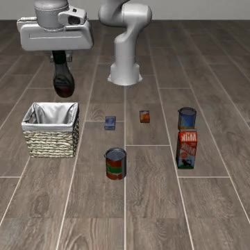</a> | [ep00 · failure](../assets/videos/libero/soup/libero_object/task00_r01_ep00_failure.mp4) (3.5s) · [ep01 · failure](../assets/videos/libero/soup/libero_object/task00_r01_ep01_failure.mp4) (3.5s) · [ep02 · failure](../assets/videos/libero/soup/libero_object/task00_r01_ep02_failure.mp4) (3.5s) |
| TIES | <a href="../assets/videos/libero/ties/libero_object/task00_r01_ep00_failure.mp4">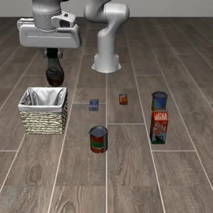</a> | [ep00 · failure](../assets/videos/libero/ties/libero_object/task00_r01_ep00_failure.mp4) (3.5s) · [ep01 · failure](../assets/videos/libero/ties/libero_object/task00_r01_ep01_failure.mp4) (3.5s) · [ep02 · failure](../assets/videos/libero/ties/libero_object/task00_r01_ep02_failure.mp4) (3.5s) |
| RegMean++ | <a href="../assets/videos/libero/regmeanpp/libero_object/task00_r01_ep00_failure.mp4"></a> | [ep00 · failure](../assets/videos/libero/regmeanpp/libero_object/task00_r01_ep00_failure.mp4) (3.5s) · [ep01 · failure](../assets/videos/libero/regmeanpp/libero_object/task00_r01_ep01_failure.mp4) (3.5s) · [ep02 · failure](../assets/videos/libero/regmeanpp/libero_object/task00_r01_ep02_failure.mp4) (3.5s) |
| FeatCal | <a href="../assets/videos/libero/featcal/libero_object/task00_r01_ep00_failure.mp4">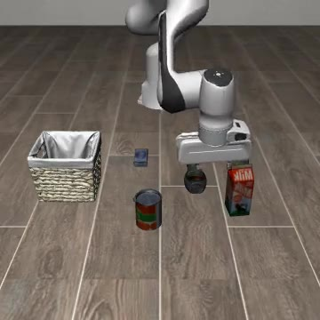</a> | [ep00 · failure](../assets/videos/libero/featcal/libero_object/task00_r01_ep00_failure.mp4) (3.5s) · [ep01 · failure](../assets/videos/libero/featcal/libero_object/task00_r01_ep01_failure.mp4) (3.5s) · [ep02 · failure](../assets/videos/libero/featcal/libero_object/task00_r01_ep02_failure.mp4) (3.5s) |
| RegMean | <a href="../assets/videos/libero/regmean/libero_object/task00_r01_ep00_failure.mp4">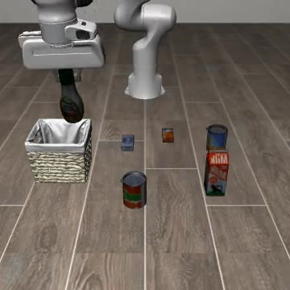</a> | [ep00 · failure](../assets/videos/libero/regmean/libero_object/task00_r01_ep00_failure.mp4) (3.5s) · [ep01 · failure](../assets/videos/libero/regmean/libero_object/task00_r01_ep01_failure.mp4) (3.5s) · [ep02 · failure](../assets/videos/libero/regmean/libero_object/task00_r01_ep02_failure.mp4) (3.5s) |
| KnOTS-TIES | <a href="../assets/videos/libero/knots_ties/libero_object/task00_r01_ep00_failure.mp4">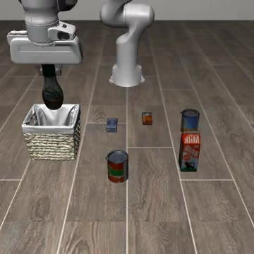</a> | [ep00 · failure](../assets/videos/libero/knots_ties/libero_object/task00_r01_ep00_failure.mp4) (3.5s) · [ep01 · failure](../assets/videos/libero/knots_ties/libero_object/task00_r01_ep01_failure.mp4) (3.5s) · [ep02 · failure](../assets/videos/libero/knots_ties/libero_object/task00_r01_ep02_failure.mp4) (3.5s) |
| Task Arithmetic | <a href="../assets/videos/libero/task_arithmetic/libero_object/task00_r01_ep00_failure.mp4">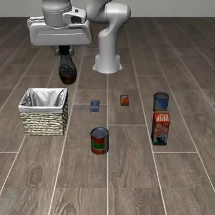</a> | [ep00 · failure](../assets/videos/libero/task_arithmetic/libero_object/task00_r01_ep00_failure.mp4) (3.5s) · [ep01 · failure](../assets/videos/libero/task_arithmetic/libero_object/task00_r01_ep01_failure.mp4) (3.5s) · [ep02 · failure](../assets/videos/libero/task_arithmetic/libero_object/task00_r01_ep02_failure.mp4) (3.5s) |
| WUDI | <a href="../assets/videos/libero/wudi/libero_object/task00_r01_ep00_failure.mp4">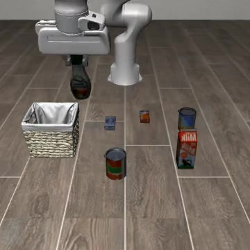</a> | [ep00 · failure](../assets/videos/libero/wudi/libero_object/task00_r01_ep00_failure.mp4) (3.5s) · [ep01 · failure](../assets/videos/libero/wudi/libero_object/task00_r01_ep01_failure.mp4) (3.5s) · [ep02 · failure](../assets/videos/libero/wudi/libero_object/task00_r01_ep02_failure.mp4) (3.5s) |
| **TCR (ours)** | <a href="../assets/videos/libero/tcr/libero_object/task00_r01_ep00_success.mp4">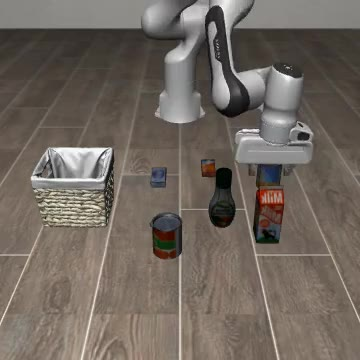</a> | [ep00 · success](../assets/videos/libero/tcr/libero_object/task00_r01_ep00_success.mp4) (1.9s) · [ep01 · failure](../assets/videos/libero/tcr/libero_object/task00_r01_ep01_failure.mp4) (3.5s) · [ep02 · failure](../assets/videos/libero/tcr/libero_object/task00_r01_ep02_failure.mp4) (3.5s) |
| **Expert (reference)** | <a href="../assets/videos/libero/experts/libero_object/task00_r01_ep00_success.mp4">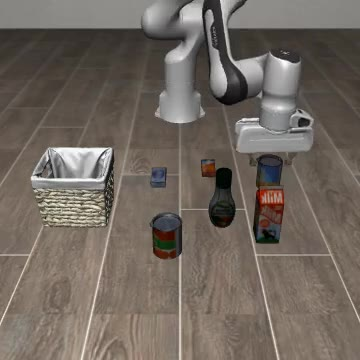</a> | [ep00 · success](../assets/videos/libero/experts/libero_object/task00_r01_ep00_success.mp4) (1.8s) · [ep01 · success](../assets/videos/libero/experts/libero_object/task00_r01_ep01_success.mp4) (1.7s) · [ep02 · success](../assets/videos/libero/experts/libero_object/task00_r01_ep02_success.mp4) (1.8s) |

### LIBERO-Goal

| Method / reference | Preview | Recordings |
| :--- | :---: | :--- |
| Soup | <a href="../assets/videos/libero/soup/libero_goal/task00_r01_ep00_failure.mp4">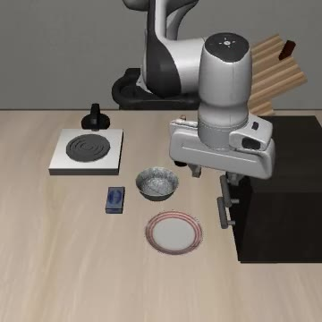</a> | [ep00 · failure](../assets/videos/libero/soup/libero_goal/task00_r01_ep00_failure.mp4) (3.8s) · [ep01 · failure](../assets/videos/libero/soup/libero_goal/task00_r01_ep01_failure.mp4) (3.8s) · [ep02 · failure](../assets/videos/libero/soup/libero_goal/task00_r01_ep02_failure.mp4) (3.8s) |
| TIES | <a href="../assets/videos/libero/ties/libero_goal/task00_r01_ep00_failure.mp4">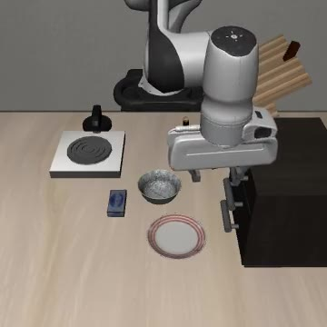</a> | [ep00 · failure](../assets/videos/libero/ties/libero_goal/task00_r01_ep00_failure.mp4) (3.8s) · [ep01 · failure](../assets/videos/libero/ties/libero_goal/task00_r01_ep01_failure.mp4) (3.8s) · [ep02 · failure](../assets/videos/libero/ties/libero_goal/task00_r01_ep02_failure.mp4) (3.8s) |
| RegMean++ | <a href="../assets/videos/libero/regmeanpp/libero_goal/task00_r01_ep00_failure.mp4">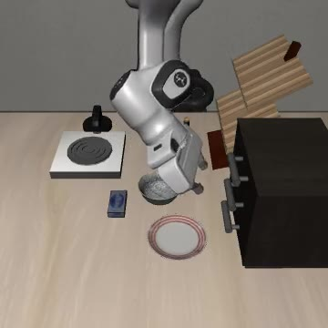</a> | [ep00 · failure](../assets/videos/libero/regmeanpp/libero_goal/task00_r01_ep00_failure.mp4) (3.8s) · [ep01 · failure](../assets/videos/libero/regmeanpp/libero_goal/task00_r01_ep01_failure.mp4) (3.8s) · [ep02 · failure](../assets/videos/libero/regmeanpp/libero_goal/task00_r01_ep02_failure.mp4) (3.8s) |
| FeatCal | <a href="../assets/videos/libero/featcal/libero_goal/task00_r01_ep00_failure.mp4">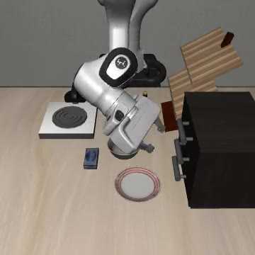</a> | [ep00 · failure](../assets/videos/libero/featcal/libero_goal/task00_r01_ep00_failure.mp4) (3.8s) · [ep01 · success](../assets/videos/libero/featcal/libero_goal/task00_r01_ep01_success.mp4) (1.9s) · [ep02 · failure](../assets/videos/libero/featcal/libero_goal/task00_r01_ep02_failure.mp4) (3.8s) |
| RegMean | <a href="../assets/videos/libero/regmean/libero_goal/task00_r01_ep00_failure.mp4">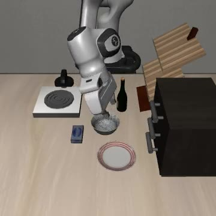</a> | [ep00 · failure](../assets/videos/libero/regmean/libero_goal/task00_r01_ep00_failure.mp4) (3.8s) · [ep01 · failure](../assets/videos/libero/regmean/libero_goal/task00_r01_ep01_failure.mp4) (3.8s) · [ep02 · failure](../assets/videos/libero/regmean/libero_goal/task00_r01_ep02_failure.mp4) (3.8s) |
| KnOTS-TIES | <a href="../assets/videos/libero/knots_ties/libero_goal/task00_r01_ep00_failure.mp4">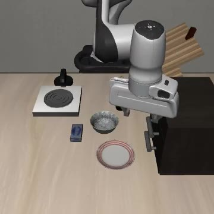</a> | [ep00 · failure](../assets/videos/libero/knots_ties/libero_goal/task00_r01_ep00_failure.mp4) (3.8s) · [ep01 · failure](../assets/videos/libero/knots_ties/libero_goal/task00_r01_ep01_failure.mp4) (3.8s) · [ep02 · failure](../assets/videos/libero/knots_ties/libero_goal/task00_r01_ep02_failure.mp4) (3.8s) |
| Task Arithmetic | <a href="../assets/videos/libero/task_arithmetic/libero_goal/task00_r01_ep00_failure.mp4">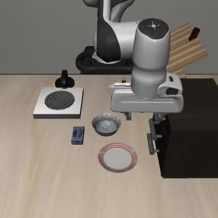</a> | [ep00 · failure](../assets/videos/libero/task_arithmetic/libero_goal/task00_r01_ep00_failure.mp4) (3.8s) · [ep01 · failure](../assets/videos/libero/task_arithmetic/libero_goal/task00_r01_ep01_failure.mp4) (3.8s) · [ep02 · failure](../assets/videos/libero/task_arithmetic/libero_goal/task00_r01_ep02_failure.mp4) (3.8s) |
| WUDI | <a href="../assets/videos/libero/wudi/libero_goal/task00_r01_ep00_failure.mp4">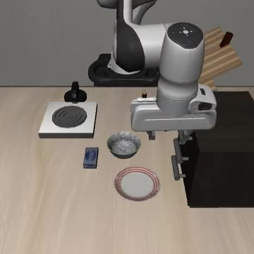</a> | [ep00 · failure](../assets/videos/libero/wudi/libero_goal/task00_r01_ep00_failure.mp4) (3.8s) · [ep01 · failure](../assets/videos/libero/wudi/libero_goal/task00_r01_ep01_failure.mp4) (3.8s) · [ep02 · failure](../assets/videos/libero/wudi/libero_goal/task00_r01_ep02_failure.mp4) (3.8s) |
| **TCR (ours)** | <a href="../assets/videos/libero/tcr/libero_goal/task00_r01_ep00_failure.mp4">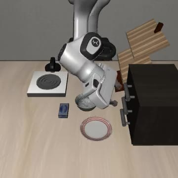</a> | [ep00 · failure](../assets/videos/libero/tcr/libero_goal/task00_r01_ep00_failure.mp4) (3.8s) · [ep01 · success](../assets/videos/libero/tcr/libero_goal/task00_r01_ep01_success.mp4) (1.8s) · [ep02 · failure](../assets/videos/libero/tcr/libero_goal/task00_r01_ep02_failure.mp4) (3.8s) |
| **Expert (reference)** | <a href="../assets/videos/libero/experts/libero_goal/task00_r01_ep00_success.mp4">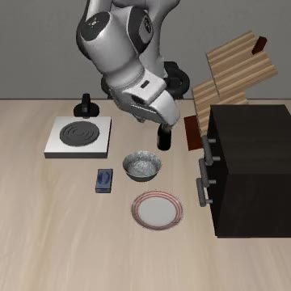</a> | [ep00 · success](../assets/videos/libero/experts/libero_goal/task00_r01_ep00_success.mp4) (1.4s) · [ep01 · success](../assets/videos/libero/experts/libero_goal/task00_r01_ep01_success.mp4) (1.4s) · [ep02 · success](../assets/videos/libero/experts/libero_goal/task00_r01_ep02_success.mp4) (1.6s) |

### LIBERO-Long

| Method / reference | Preview | Recordings |
| :--- | :---: | :--- |
| Soup | <a href="../assets/videos/libero/soup/libero_10/task00_r01_ep00_failure.mp4">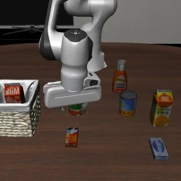</a> | [ep00 · failure](../assets/videos/libero/soup/libero_10/task00_r01_ep00_failure.mp4) (6.5s) · [ep01 · failure](../assets/videos/libero/soup/libero_10/task00_r01_ep01_failure.mp4) (6.5s) · [ep02 · failure](../assets/videos/libero/soup/libero_10/task00_r01_ep02_failure.mp4) (6.5s) |
| TIES | <a href="../assets/videos/libero/ties/libero_10/task00_r01_ep00_failure.mp4">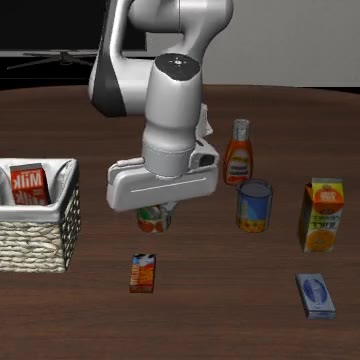</a> | [ep00 · failure](../assets/videos/libero/ties/libero_10/task00_r01_ep00_failure.mp4) (6.5s) · [ep01 · failure](../assets/videos/libero/ties/libero_10/task00_r01_ep01_failure.mp4) (6.5s) · [ep02 · failure](../assets/videos/libero/ties/libero_10/task00_r01_ep02_failure.mp4) (6.5s) |
| RegMean++ | <a href="../assets/videos/libero/regmeanpp/libero_10/task00_r01_ep00_failure.mp4">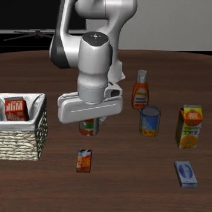</a> | [ep00 · failure](../assets/videos/libero/regmeanpp/libero_10/task00_r01_ep00_failure.mp4) (6.5s) · [ep01 · failure](../assets/videos/libero/regmeanpp/libero_10/task00_r01_ep01_failure.mp4) (6.5s) · [ep02 · failure](../assets/videos/libero/regmeanpp/libero_10/task00_r01_ep02_failure.mp4) (6.5s) |
| FeatCal | <a href="../assets/videos/libero/featcal/libero_10/task00_r01_ep00_success.mp4">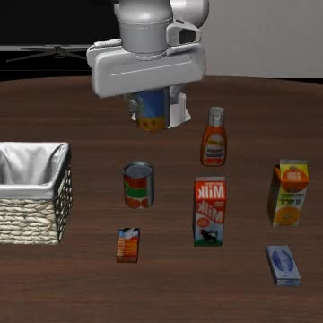</a> | [ep00 · success](../assets/videos/libero/featcal/libero_10/task00_r01_ep00_success.mp4) (3.1s) · [ep01 · success](../assets/videos/libero/featcal/libero_10/task00_r01_ep01_success.mp4) (4.4s) · [ep02 · success](../assets/videos/libero/featcal/libero_10/task00_r01_ep02_success.mp4) (3.6s) |
| RegMean | <a href="../assets/videos/libero/regmean/libero_10/task00_r01_ep00_failure.mp4">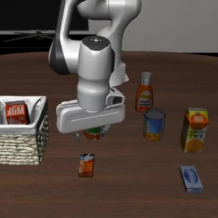</a> | [ep00 · failure](../assets/videos/libero/regmean/libero_10/task00_r01_ep00_failure.mp4) (6.5s) · [ep01 · failure](../assets/videos/libero/regmean/libero_10/task00_r01_ep01_failure.mp4) (6.5s) · [ep02 · failure](../assets/videos/libero/regmean/libero_10/task00_r01_ep02_failure.mp4) (6.5s) |
| KnOTS-TIES | <a href="../assets/videos/libero/knots_ties/libero_10/task00_r01_ep00_failure.mp4">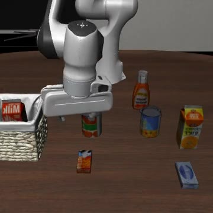</a> | [ep00 · failure](../assets/videos/libero/knots_ties/libero_10/task00_r01_ep00_failure.mp4) (6.5s) · [ep01 · failure](../assets/videos/libero/knots_ties/libero_10/task00_r01_ep01_failure.mp4) (6.5s) · [ep02 · failure](../assets/videos/libero/knots_ties/libero_10/task00_r01_ep02_failure.mp4) (6.5s) |
| Task Arithmetic | <a href="../assets/videos/libero/task_arithmetic/libero_10/task00_r01_ep00_failure.mp4">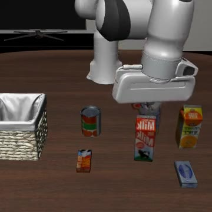</a> | [ep00 · failure](../assets/videos/libero/task_arithmetic/libero_10/task00_r01_ep00_failure.mp4) (6.5s) · [ep01 · failure](../assets/videos/libero/task_arithmetic/libero_10/task00_r01_ep01_failure.mp4) (6.5s) · [ep02 · failure](../assets/videos/libero/task_arithmetic/libero_10/task00_r01_ep02_failure.mp4) (6.5s) |
| WUDI | <a href="../assets/videos/libero/wudi/libero_10/task00_r01_ep00_failure.mp4">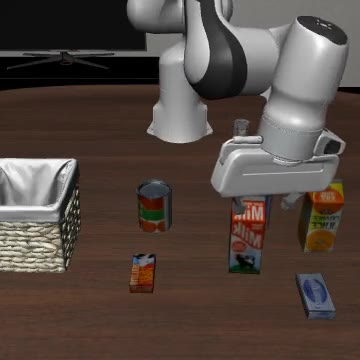</a> | [ep00 · failure](../assets/videos/libero/wudi/libero_10/task00_r01_ep00_failure.mp4) (6.5s) · [ep01 · failure](../assets/videos/libero/wudi/libero_10/task00_r01_ep01_failure.mp4) (6.5s) · [ep02 · failure](../assets/videos/libero/wudi/libero_10/task00_r01_ep02_failure.mp4) (6.5s) |
| **TCR (ours)** | <a href="../assets/videos/libero/tcr/libero_10/task00_r01_ep00_success.mp4">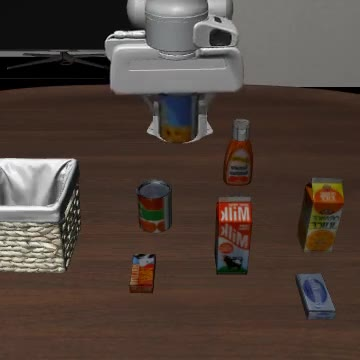</a> | [ep00 · success](../assets/videos/libero/tcr/libero_10/task00_r01_ep00_success.mp4) (2.8s) · [ep01 · success](../assets/videos/libero/tcr/libero_10/task00_r01_ep01_success.mp4) (3.3s) · [ep02 · success](../assets/videos/libero/tcr/libero_10/task00_r01_ep02_success.mp4) (3.2s) |
| **Expert (reference)** | <a href="../assets/videos/libero/experts/libero_10/task00_r01_ep00_success.mp4">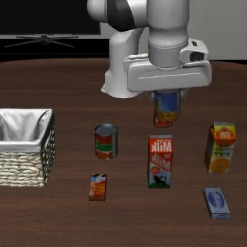</a> | [ep00 · success](../assets/videos/libero/experts/libero_10/task00_r01_ep00_success.mp4) (3.2s) · [ep01 · success](../assets/videos/libero/experts/libero_10/task00_r01_ep01_success.mp4) (3.3s) · [ep02 · failure](../assets/videos/libero/experts/libero_10/task00_r01_ep02_failure.mp4) (6.5s) |

## Provenance

- Real-robot sources: `视频.zip`; method folders TCR, Expert, Featcal, RegMean++, Mean Soup, and TIES. All 48 source clips are represented.
- Simulation sources: `videos(1).zip`; all 120 MP4s are retained byte-for-byte. Method/suite names and success/failure labels follow the supplied files.
- Real-robot derivatives: full-duration H.264 MP4, at most 1280 × 720, 30 fps, muted, and without source location/device metadata. Original filenames are preserved in the manifest; MP4 filenames are lowercase for portable links.
- README previews: TCR real-robot GIFs at 2× source speed and LIBERO GIFs at 0.25× supplied file playback speed, including failure examples. Six comparison panels show the selected methods at those same speeds, with final frames held for ended clips. See the [comparison manifest](../assets/comparisons/manifest.json) for exact inputs. The 168 original recording MP4s keep their supplied durations.
- Original ZIPs and MOVs are kept outside the repository. Videos are demonstrations, not model weights, datasets, or calibration caches.

See [assets/media.json](../assets/media.json) for source filenames, paths, durations, dimensions, and outcome labels. For browser playback and GitHub Pages setup, see [Publishing](PUBLISHING.md).

To rebuild this index after updating the manifest:

```bash
python scripts/build_video_index.py
```
